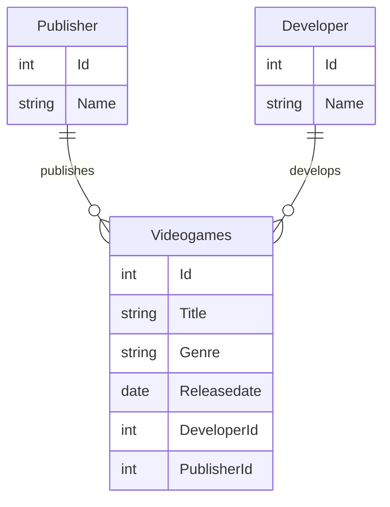

# VideoGameDB

```mermaid
erDiagram
    Publisher ||--o{ Videogames : publishes
    Developer ||--o{ Videogames : develops
    
    Publisher {
        int Id
        string Name
    }
    
    Developer {
        int Id
        string Name
    }
    
    Videogames {
        int Id
        string Title
        string Genre
        date Releasedate
        int DeveloperId
        int PublisherId
    }
```